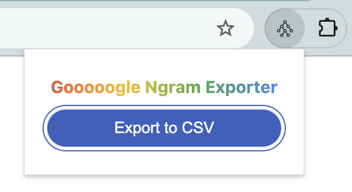

# Google Ngram Exporter

This Google Chrome extension will export the phrase frequency data from **Google Books Ngram Viewer**1 as a CSV file.

## Usage

Load the unpacked extension folder. Pin the extension into the browser. Create a phrase query in the Google Books Ngram Viewer. Export the data by opening the extension and pressing "Export to CSV".

## License

All rights reserved. Icon by Alexander Blagochevsky2.

1[Google Books Ngram Viewer](https://books.google.com/ngrams/)
2[Treemap](https://thenounproject.com/browse/icons/term/treemap/)
